# PREBPMN

**P**robabilistic **R**untime **E**nforcement of Executable **BPMN** Processes (**PREBPMN**)

#### **Table of Contents**

1. [Background of the project](#backgroud)

2. [Features of the project](#feature)

3. [Overview of the tool chain](#tool)

4. [Technology Stack](#techstack)

5. [Installation & Configuration](#inconfig)

   ​	5.1 [Installation](#install)

   ​	5.2 [Configuration](#config)

6. [Structure of the project](#struct)

7. [Operating instructions](#instruction)

## 1. Background of the project <a name="backgroud"/>

Business processes are a structured set of tasks that model a specific service or product. 

Business processes do not execute once and for all, but are executed multiple times resulting in multiple instances.  

Business Process Modeling Notation (BPMN) is the de-facto standard for business processes modelling.

In this context, this is particularly difficult to ensure correctness and efficiency of the multiple execution of a process. 

The project aims to resolve this problem.

## 2. Features of the project <a name="feature"/>

The project enables the modelling, deployment and monitoring of executable BPMN processes.

By using the runtime enforcement techniques (such as reordering,  buffering), it makes sure that the running BPMN processes satisfy the given properties.

- BPMN Simulator

  - Among these, the simulator can be defined by the user.
  - Firstly, it creates and configures the BPMN processes that can be executed.
  - Secondly, the workload of the process is defined and different execution instances are generated.
  - Thirdly, the processes are monitored at runtime.

- Transforming BPMN model into Formal Model (LTS/PTS)

  - Transforming BPMN model into LTS

  - Probabilistic Formal Model (PTS)
    - Compute the probability of each branches of BPMN model (PTS) at runtime

- Probabilistic Property

  - Using Model Checking Language (MCL) to describes the probabilistic properties of BPMN processes

- Probabilistic Model Checking

  - Using CADP as a Probabilistic Model Checker to verify the probabilistic property of BPMN processes

- Runtime Enforcement Mechanism

  - Make sure that the behavior(s) of BPMN processes  satisfy the given properties.

  

## 3. Overview of the tool chain <a name="tool"/>

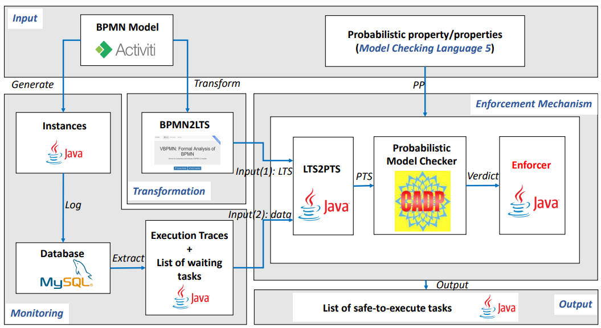

##  4. Technology Stack <a name="techstack"/>

### 4.1 Type of project

- Maven >= 1.7
### 4.2 Modeller and simulator for BPMN processes
- Java >= 1.8
- MySQL >= 8.0
- Activiti ==  6.0
- Ecplise IDE
- Activiti Designer plugin in Eclipse

### 4.3 Transforming BPMN model into formal model (LTS)
- VBPMN
- Tomcat >= 8.5
### 4.4  Probabilistic Model Checking
- CADP

### 4.5 Operating environments

- Linux / Windows

## 5. Installation & Configuration <a name="inconfig"/>

### 5.1 Installation <a name="install"/>

#### 5.1.1 Building the environment to run the BPMN model

- Step 0: Install Maven [Link: Installing Apache Maven](https://maven.apache.org/install.html)

- Step 1: Install Java  [Link: Java Downloads](https://www.oracle.com/fr/java/technologies/downloads/)

- Step 2: Install Eclipse [Link: Downlaod Eclipse](https://www.eclipse.org/downloads/)

- Step 3: Adding Activiti Designer plugin in Eclipse [Link: How to install Activiti Designer plugin in Eclipse/STS](https://websparrow.org/misc/how-to-install-activiti-designer-plugin-in-eclipse-sts)

#### 5.1.2 Building the environment to Probabilistic Model Checking

- Installation of CADP Tools [Link: install CADP](https://cadp.inria.fr/registration/)

#### 5.1.3 Transforming BPMN model into formal Model (LTS) ([Link: VBPMN](https://pascalpoizat.github.io/vbpmn-web/index.html))

- Step 0. Install Tomcat [Link: Download Tomcat 8.5](https://tomcat.apache.org/download-80.cgi)

- Step 1. Here [(Link)](./VBPMN/) you can find "transformation.war", and then deploy it in Tomcat

- VBPMN instructions at here [Link: instructions ](https://pascalpoizat.github.io/vbpmn-web/tour.html)

### 5.2 Configuration <a name="config"/>

- Step 0: git clone https://github.com/ahzm-code/PREBPMN.git

- Step 1: In Eclipse, select File->Import-> Maven -> Exisiting Maven Projects

- Step 2: Adding Maven dependencies

- Step 3: Updating database information

Go to the "src/main/resources/" directory, then configure the database name, account and password (**activiti.cfg.xml**).

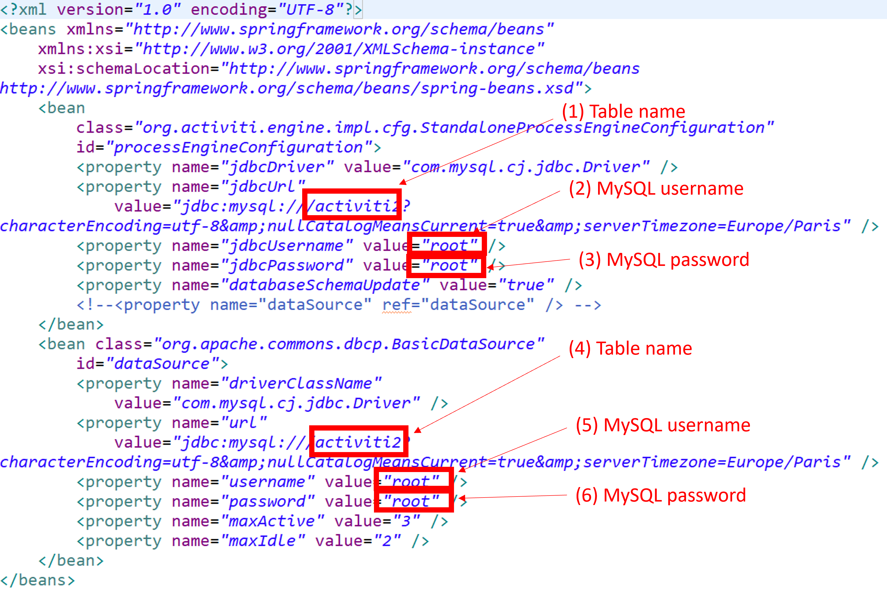

## 6. Structure of the project <a name="struct"/>

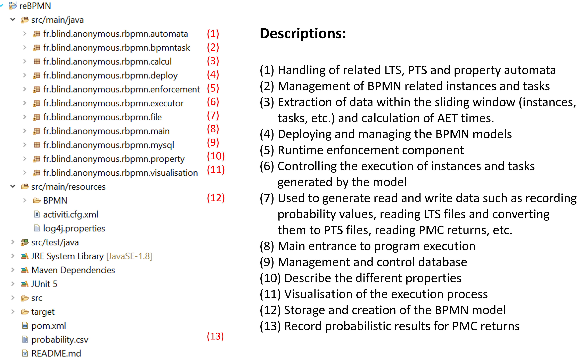

## 7. Operating instructions <a name="instruction"/>

### 7.1 Creating a BPMN process

7.1.1 Go to folder "src/main/resources/bpmn", then right click and select 'new', then 'other', then select "Activiti Diagram" under the "Acitiviti" folder (see figure blew).

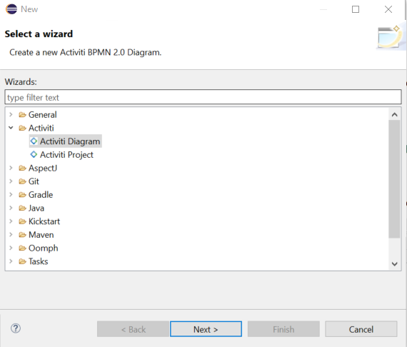

7.1.2 Configure BPMN ID & BPMN name

Select the "Properties" section.

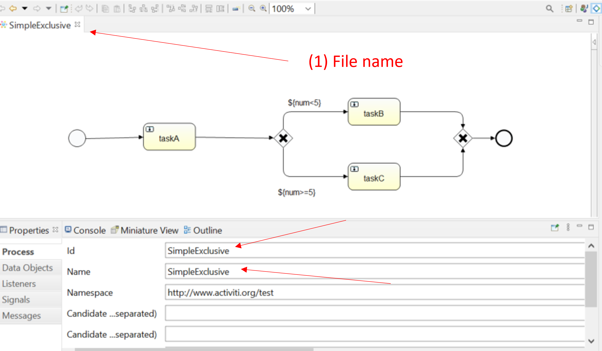

7.1.2 Configure (Inclusive or Exclusive) Gateway Conditions

Select the "Properties" section.

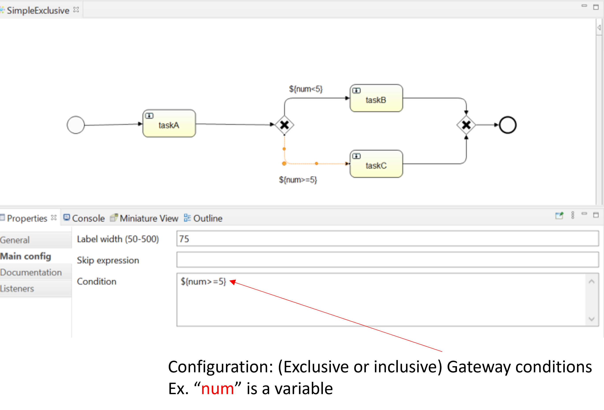

### 7.2 Deploying a BPMN process

Deploying a process

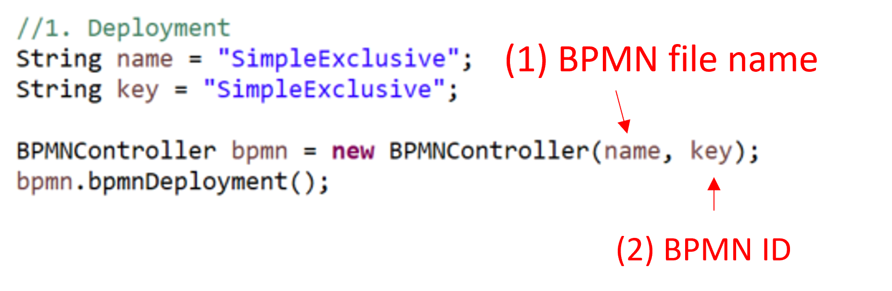

### 7.3 Create the instances of the process

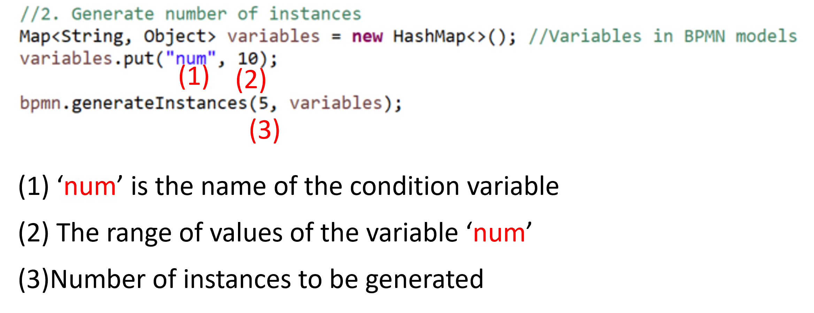

### 7.4 Generate LTS and initialise PTS

There are two ways to do this, either manually or automatically using **VBPMN**

#### 7.4.1 Manual execution

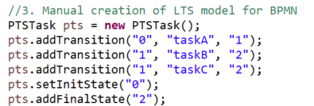

#### 7.4.2 Automatic execution 

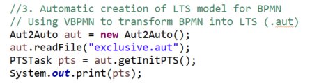

### 7.5 Defining the properties of verification

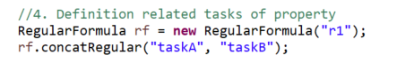

### 7.6 Initialising the PMC component

The current code contains simple PMC computations, but complex properties need to be used in conjunction with CADP (which requires a path to be configured in the class file).

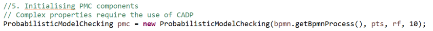

### 7.7 Complete probabilistic properties

Example: The probability of task B following task A is less than or equal to 0.5.

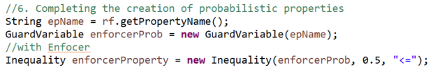

### 7.8 Initialising the PRE (Probabilistic Runtime Enforcement) component

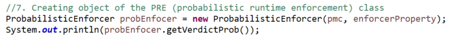

### 7.9 Initialising the visualisation component

The variable *period*  indicates how often the visualisation is presented at each interval of time

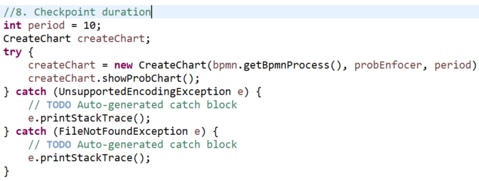

### 7.10 Start running the project

Start running the deployed BPMN project 

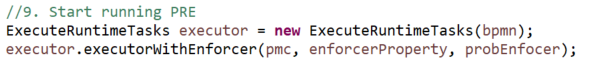